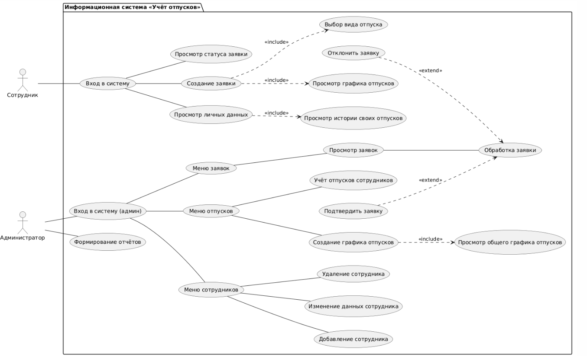

# Учёт отпусков сотрудников

Информационная система для **автоматизации учёта отпусков** сотрудников организации.
Проект выполняется на **Python** с базой данных **SQLite**.

## Что умеет программа
- ведение информации о сотрудниках (ФИО, должность, подразделение)
- подача заявок на отпуск сотрудником
- подтверждение и отклонение заявок администратором
- формирование графика отпусков и отчётов

## Как запустить
1. Установить Python
2. Выполнить в папке проекта команду: `python src/main.py`

## Информация из лабораторной работы 1
**Тема:** постановка задачи и моделирование процессов информационной системы «Учёт отпусков сотрудников».

**Роли пользователей:**
- **Администратор** (сотрудник отдела кадров) — управляет сотрудниками, обрабатывает заявки, формирует график и отчёты
- **Сотрудник** — создаёт заявки на отпуск, смотрит их статус и историю отпусков

**Цели системы:**
1. Переход от бумажного учёта к электронному
2. Упрощение планирования отпусков
3. Контроль запланированных и использованных отпусков
4. Снижение количества ошибок в датах

## Структура проекта
| Файл | Назначение |
|------|------------|
| src/main.py | код программы |
| docs/diagrams/usecase.puml | текст диаграммы PlantUML |
| docs/diagrams/usecase.png | картинка диаграммы |
| README.md | описание проекта |

## Диаграмма Use Case

## Автор
Германскова Е.В., гр. 26-ИВТ-2-1.